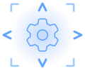

# Rig Core

<table width="600"><tr>
<td width="150"></td>
<td>Shared core library for <a href="https://github.com/rokubop/talon-mouse-rig">talon-mouse-rig</a> and <a href="https://github.com/rokubop/talon-gamepad-rig">talon-gamepad-rig</a>. Provides base classes, lifecycle, layer groups, mode operations, and animation infrastructure.</td>
</tr></table>

This repo does nothing by itself - it's meant to be used as a dependency by other rigs.

## Installation

Clone this repo into your [Talon](https://talonvoice.com/) user directory:

```sh
# Mac/Linux
cd ~/.talon/user

# Windows
cd ~/AppData/Roaming/talon/user

git clone https://github.com/rokubop/talon-rig-core
```
